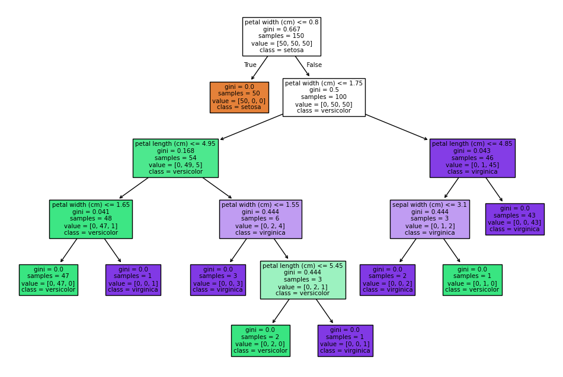

# DECISION-TREE
COMPANY: CODTECH IT SOLUTIONS

NAME: BHARAT BHANDARI

INTERN ID: CT04DF123

DOMAIN: MACHINE LEARNING

DURATION: 4 WEEKS

MENTOR: NEELA SANTOSH

# Task 1 – Decision Tree Classifier (CodTech ML Internship)
This repository contains my submission for Task 1 of the CodTech Machine Learning Internship.
The goal of this task was to build and visualize a Decision Tree Classifier using the Scikit-Learn library on a popular dataset.
For this project, I worked in JupyterLab (via Anaconda) and followed a clean, step-by-step approach to complete this task 

***

### Objective

- Load and explore the dataset**

- Preprocess the data if needed

- Train a Decision Tree model

- Visualize the tree structure

- Evaluate the model's performance

This was a great hands-on exercise to understand how decision trees work in practice.

*** 

# Dataset used 
We worked with the Iris dataset, a classic dataset that comes bundled with Scikit-Learn. It’s often used for learning and experimenting with classification models, especially in pattern recognition tasks.

Key Features:

- Sepal Length

- Sepal Width

- Petal Length

- Petal Width

Target Classes:

- Iris-Setosa

- Iris-Versicolor

- Iris-Virginica

The dataset includes 150 flower samples, with an equal number (50 each) from all three species. It’s a well-balanced dataset and ideal for visualizing how decision boundaries are formed by classifiers like Decision Trees.

***

# Parameters 
criterion:
This decides how the model checks the "purity" of a split. You can choose 'gini' (default), 'entropy', or 'log_loss'.

splitter:
Controls how the tree picks where to split at each node. Options are 'best' (default – picks the best one) or 'random' (picks randomly).

max_features:
Limits how many features the model should consider when looking for the best split. Useful to avoid overfitting.

max_depth:
Sets how deep the tree can grow. If set to None (default), the tree will grow until all leaves are pure or contain fewer than the minimum required samples.

min_samples_split:
Minimum number of samples needed to split a node. Default is 2.

min_samples_leaf:
Minimum number of samples that must be at a leaf node (end node). Default is 1.

max_leaf_nodes:
Lets you set a limit on how many final (leaf) nodes the tree can have.

min_impurity_split:
A threshold for stopping the tree early if a node’s impurity is below this value. (Note: it's deprecated now; pruning is preferred.)
class_weight:
Lets you give different importance to each class. Helpful for imbalanced datasets.

ccp_alpha:
A pruning parameter that helps simplify the tree by removing less important branches. Higher value means a simpler tree.
***
## Requirements
Before running the notebook, make sure you have the following libraries installed:
<pre>Use the command `pip install scikit-learn` to install the library.
</pre>
***

# Steps Performed
***
### 1. Importing libraries
```python 
import pandas as pd  
from sklearn.tree import DecisionTreeClassifier, plot_tree
import matplotlib.pyplot as plt
%matplotlib inline
```
We import essential libraries like Pandas, Matplotlib, and Scikit-Learn for building and visualizing the decision tree model.

### 2.	Data Loading

``` python
from sklearn.datasets import load_iris
iris = load_iris()
```
To perform classification, we load a sample dataset. Here, we use the Iris dataset, which comes built-in with Scikit-Learn and is commonly used for classification problems.

### 3.Splitting the Dataset

``` python
from sklearn.model_selection import train_test_split

X = iris.data
y = iris.target

X_train, X_test, y_train, y_test = train_test_split(
    X, y, test_size=0.25, random_state=42)
```
We split the dataset into training and testing sets using the train_test_split method.

75% of the data is used for training

25% is used for testing (as specified by test_size=0.25)


### 4. Model Training & Visualization

``` python
model = DecisionTreeClassifier(max_depth=2)  # limiting tree depth to 2
model.fit(X_train, y_train)

plt.figure(figsize=(10, 6))
plot_tree(model, feature_names=iris.feature_names, filled=True)
plt.show()
```
We define and train the DecisionTreeClassifier model.

To keep the tree simple and easy to interpret, we set max_depth=2.

The structure of the tree is visualized using Scikit-Learn's plot_tree() function.



We trained a Decision Tree Classifier on the Iris dataset and visualized the structure using plot_tree() from Scikit-Learn. The diagram below illustrates how the dataset is split at each internal node based on feature thresholds.


This visualization provides insight into how decisions are made by the model at each split. The tree has multiple levels with a maximum depth set for interpretability, resulting in an accuracy of approximately 0.98.

 What the visualization shows:
- Feature used for splitting (e.g., petal length (cm))

- Threshold values at each decision node

- Gini impurity score (indicating node purity)

- Class distribution at each node (value = [...])

- Predicted class label when a node is pure

This allows us to clearly understand the model’s logic and interpret how it reaches its final predictions.

### 5.  Making Predictions & Evaluating the Model

``` python
y_pred = model.predict(X_test)

from sklearn.metrics import accuracy_score, classification_report

score = accuracy_score(y_test, y_pred)
print(score)
print(classification_report(y_test, y_pred))

```
After training the model, we tested it on unseen data (X_test). The model's predictions (y_pred) were compared against the actual labels (y_test) using:

 - Accuracy Score – measures the overall correctness of the model

- Classification Report – includes precision, recall, F1-score for each class

The evaluation confirms that our model performs well, with high precision and accuracy, indicating good generalization on the test data.


